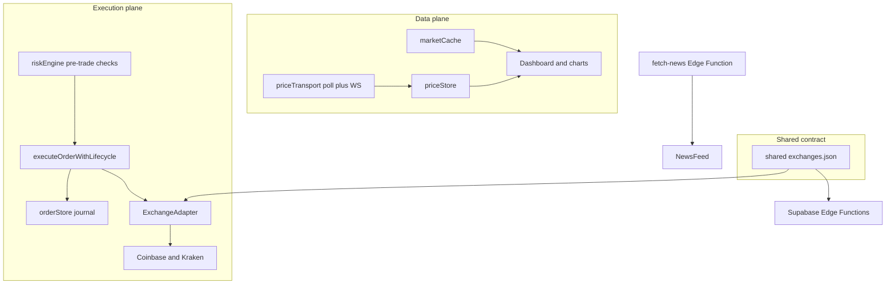

# GoldTrackr Roadmap

One-page navigable summary of shipped work and open OMS gaps. Deep vision and agent guidance live in [code_plan.md](../code_plan.md) and [AGENTS.md](../AGENTS.md).

> **For agents:** GitHub issue state ≠ ship status. Verify features on `main` via the [closed-issues table](../code_plan.md#for-agents--closed-issues-vs-shipped) in `code_plan.md`.

---

## Shipped on `main` (snapshot)

- **Prices & metals** — 60s REST poll (CoinGecko + MetalPrice), mock fallback
- **Execution** — Coinbase CDP + Kraken, dry-run default, Supabase Edge Functions
- **Paper ledger** — `paperTradeStore`, `PaperLedgerPanel`, `lib/paperTrade.ts` ([#35](https://github.com/ford442/gold_tracker/issues/35))
- **Market history cache** — `lib/marketCache.ts` ([#34](https://github.com/ford442/gold_tracker/issues/34))
- **Exchange adapter Phase A** — `exchangeAdapters.ts` + `exchanges.ts` ([#33](https://github.com/ford442/gold_tracker/issues/33))
- **Tax lots** — `portfolioLots.ts` + cost-basis UI ([#41](https://github.com/ford442/gold_tracker/issues/41))
- **E2E smoke** — `e2e/` + CI job ([#36](https://github.com/ford442/gold_tracker/issues/36))
- **Backtesting & Scenario Lab** — `strategyEngine.ts`
- **Regime / fidelity** — `regime.ts`, Fidelity & Regimes tab
- **Typed Supabase client** — `supabase.ts` + mock fallback ([#40](https://github.com/ford442/gold_tracker/issues/40))

---

## Open work

| Theme | Issue | Priority | Mock / live note |
|-------|-------|----------|------------------|
| Order lifecycle | [#46](https://github.com/ford442/gold_tracker/issues/46) | P0 | Live trades are fire-and-report today |
| Shared exchange registry | [#45](https://github.com/ford442/gold_tracker/issues/45) | P1 | Edge Functions still duplicate pair maps |
| Adapter unification | [#47](https://github.com/ford442/gold_tracker/issues/47) | P0 | Arb monitor bypasses selected exchange |
| Live risk engine | [#50](https://github.com/ford442/gold_tracker/issues/50) | P1 | Only `maxTradeSize` pre-trade gate today |
| WebSocket prices | [#48](https://github.com/ford442/gold_tracker/issues/48) | P1 | 60s REST poll; re-open #38 |
| Observability | [#49](https://github.com/ford442/gold_tracker/issues/49) | P2 | Toasts + `OfflineBanner` only |
| Real multi-venue arb | [#53](https://github.com/ford442/gold_tracker/issues/53) | P2 | Synthetic signals in global monitor |
| Gold news proxy | [#52](https://github.com/ford442/gold_tracker/issues/52) | P2 | Mock-only news; re-open #28 |
| Analytics workers | [#54](https://github.com/ford442/gold_tracker/issues/54) | P2 | Main-thread backtest/regime math |
| Docs refresh | [#51](https://github.com/ford442/gold_tracker/issues/51) | P0 | This document |

Issues [#46](https://github.com/ford442/gold_tracker/issues/46)–[#50](https://github.com/ford442/gold_tracker/issues/50) may show **closed** on GitHub before code merges to `main` — always check file presence on `main`.

---

## Architecture target

**Today on `main`:** data plane is REST-only; execution is fire-and-report without `riskEngine` / `orderStore`; registry is client-only `exchanges.ts`; news is mock.

---

## Cross-links

- [code_plan.md](../code_plan.md) — OMS vision, Done/Remaining checklists, agent closed-vs-shipped table
- [AGENTS.md](../AGENTS.md) — file map, conventions, mock vs live behavior
- [README.md](../README.md) — user-facing quick start
- [GitHub Issues](https://github.com/ford442/gold_tracker/issues) — track and pick up work
