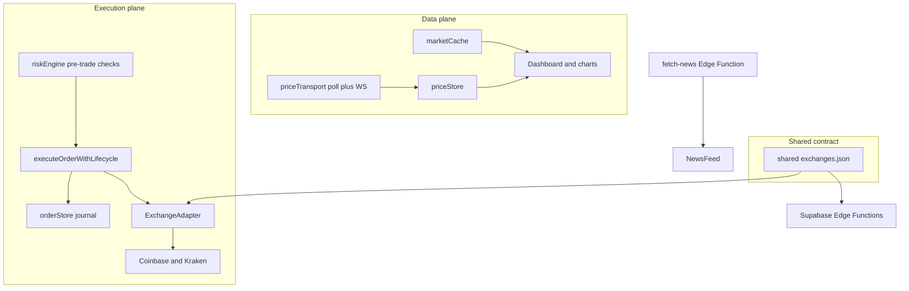

# GoldTrackr Roadmap

One-page navigable summary of shipped work and verified open gaps. Deep vision and agent guidance live in [code_plan.md](../code_plan.md) and [AGENTS.md](../AGENTS.md).

> **Truth protocol (for agents):** GitHub issue state ≠ ship status. Verify with (1) `git ls-tree origin/main -- <path>`, (2) import wiring from hooks/UI, (3) [docs/SHIPPED.md](SHIPPED.md). See [code_plan.md § Truth protocol](../code_plan.md#truth-protocol-for-agents).

---

## Shipped on `main` (snapshot)

- **Prices & metals** — REST (60s) + optional WebSocket transport (`priceTransport.ts`, Settings → Data Feed: auto / poll / stream); mock fallback
- **Order lifecycle (client)** — `orderLifecycle.ts`, `orderStore`, `executeOrderWithLifecycle`, `useOrderReconciliation`, `OrderHistoryPanel`
- **Risk engine** — `riskEngine.ts`, `useRiskContext`, Settings kill-switch / limits ([#50](https://github.com/ford442/gold_tracker/issues/50))
- **Execution** — Coinbase CDP + Kraken via `exchangeAdapters` + `executeOrder.ts`, dry-run default, Supabase Edge Functions
- **Shared registry** — `shared/exchanges.json` + `shared/registry.ts`; Edge re-export ([#45](https://github.com/ford442/gold_tracker/issues/45))
- **Paper ledger** — `paperTradeStore`, `PaperLedgerPanel`, `lib/paperTrade.ts` ([#35](https://github.com/ford442/gold_tracker/issues/35))
- **Market history cache** — `lib/marketCache.ts` ([#34](https://github.com/ford442/gold_tracker/issues/34))
- **Multi-venue arb** — `venueQuoteFanout.ts` + `GlobalArbitrageMonitor` (Coinbase, Kraken, Gemini quote-only) ([#53](https://github.com/ford442/gold_tracker/issues/53))
- **News proxy** — `fetch-news` Edge Function + `newsService.ts`; mock when Supabase absent ([#52](https://github.com/ford442/gold_tracker/issues/52))
- **Analytics workers** — `workers/analyticsWorker.ts` + `workerClient.ts` ([#54](https://github.com/ford442/gold_tracker/issues/54))
- **Tax lots** — `portfolioLots.ts` + cost-basis UI ([#41](https://github.com/ford442/gold_tracker/issues/41))
- **E2E smoke** — `e2e/` + CI job ([#36](https://github.com/ford442/gold_tracker/issues/36))
- **Backtesting & Scenario Lab** — `strategyEngine.ts` (mock ticks; real-tick replay still open)
- **Regime / fidelity** — `regime.ts`, Fidelity & Regimes tab
- **Typed Supabase client** — `supabase.ts` + mock fallback ([#40](https://github.com/ford442/gold_tracker/issues/40))

---

## Open work (verified gaps)

| Theme | Issue / track | Priority | Note |
|-------|---------------|----------|------|
| Observability | [#49](https://github.com/ford442/gold_tracker/issues/49) | P1 | Toasts + `OfflineBanner` only; no health/latency dashboard |
| Server order journal | — | P1 | Client `orderStore` only; Postgres durability not wired |
| Historical backtests | — | P2 | `strategyMockTicks.ts` only; no CoinGecko tick replay |
| Gemini trading | — | P2 | Quote-only today (`canTrade: false` in registry) |
| `lint:strict` CI | — | P2 | ~52 violations; not a required CI gate yet |
| WASM offload | [#32](https://github.com/ford442/gold_tracker/issues/32) | P3 | Deferred; web workers shipped ([#54](https://github.com/ford442/gold_tracker/issues/54)) |

Issues [#45](https://github.com/ford442/gold_tracker/issues/45)–[#54](https://github.com/ford442/gold_tracker/issues/54) may show **closed** on GitHub while docs lagged — the table above reflects **`main` code**, not issue state.

---

## Architecture target

```mermaid
flowchart TB
  subgraph dataPlane [Data plane]
    Transport[priceTransport poll plus WS]
    PriceStore[priceStore]
    MarketCache[marketCache]
    Transport --> PriceStore
    MarketCache --> Components[Dashboard and charts]
    PriceStore --> Components
  end

  subgraph execPlane [Execution plane]
    Risk[riskEngine pre-trade checks]
    Execute[executeOrderWithLifecycle]
    OrderStore[orderStore journal]
    Adapter[ExchangeAdapter]
    Venues[Coinbase and Kraken]
    Risk --> Execute
    Execute --> OrderStore
    Execute --> Adapter
    Adapter --> Venues
  end

  subgraph shared [Shared contract]
  Registry[shared exchanges.json]
  end

  Registry --> Adapter
  Registry --> EdgeFns[Supabase Edge Functions]
  FetchNews[fetch-news Edge Function] --> NewsFeed[NewsFeed]
```

**Today on `main`:** the diagram above is largely implemented client-side. Gaps: observability UI, server-durable `orderStore` (journal is browser `localStorage`), Gemini execution adapter, and real-tick backtest seeding.

---

## Cross-links

- [code_plan.md](../code_plan.md) — OMS vision, Done/Remaining checklists, truth protocol, closed-vs-shipped table
- [SHIPPED.md](SHIPPED.md) — agent checklist with verify paths
- [AGENTS.md](../AGENTS.md) — file map, conventions, mock vs live behavior
- [README.md](../README.md) — user-facing quick start
- [GitHub Issues](https://github.com/ford442/gold_tracker/issues) — track and pick up work
